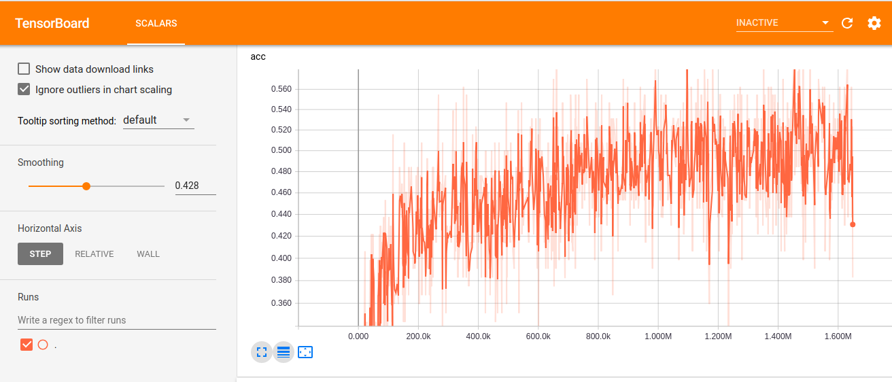

---

layout: post
title: "Generando letras de tango automáticamente. Episodio 1."
date: 2018-11-10
mathjax: true

---

## El problema

La idea de este post es simple: generar una red neuronal que pueda generar de forma (casi) autónoma letras de tango. Nada extremadamente innovador. Hay toneladas de intentos (con diferente grado de éxito) de entrenar computadoras para que generen texto de forma automática.

Solamente por citar algunos -se pueden encontrar muchas más solamente googleando "LSTM text generation":

- Un primer [ejercicio con Keras](https://machinelearningmastery.com/text-generation-lstm-recurrent-neural-networks-python-keras/)
- 
- Un [generador de letras](https://medium.com/coinmonks/word-level-lstm-text-generator-creating-automatic-song-lyrics-with-neural-networks-b8a1617104fb)
- Otro [generador de poemas](https://www.analyticsvidhya.com/blog/2018/03/text-generation-using-python-nlp/) pero con una linda explicación de algunas estructuras de datos.

En general hay bastante en idioma inglés... en castellano parece haber bastante menos. Y sobre tango muuucho menos aún. Es así que nuestra idea es tomar como input el [scrap de letras de tango](https://github.com/gefero/tango_scrap) que hicimos hace un tiempito y ver si es posible utilizarlo como insumo. Ahora bien, teniendo en cuenta el tipo de datos que tenemos (texto) y su cantidad (algo así como 5MB de strings) lo más razonable sería pensar en algún esquema de redes neuronales.

Ahora bien, podemos pensar un texto como compuesto de diferentes elementos según el nivel de "agregación" que querramos usar: párrafos, oraciones, palabras, caracteres. De hecho, un texto es una secuencia de esos elementos, en el sentido en que el orden de esos elementos es importante: el orden de los caracteres hacen palabras y cambiándolos obtenemos una palabra distinta (o una secuencia sin sentido).

## La técnica - LSTM Neural Networks

De hecho, lo que vamos a buscar es tratar de predecir cada cararcter de una palabra a partir de una ventana de caracteres anteriores. Esto hace que el uso de las Feed Forward Neural Networks no sean buenas para este tipo de tareas. En general, este tipo de problemas se encaran con Recurrent Neural Networks, que son redes neuronales con una especie de "loop" que les permite captar información proveniente de secuencias. Es más, vamos a usar una variante especial de las RNN, llamadas, Long-Short Term Memory (LSTM) Neural Networks que permiten solucionar ciertos problemas con el "flujo" de la información a lo largo de la red y la llamada "dependencia a largo plazo".

Vamos a utilizar una arquitectura de red que consta de las siguientes capas:

1. LSTM_1 de 128 neuronas
2. Dropout_1 del 50% -para regularizar-
3. LSTM_2 de 128 neuronas
4. Dropout_2 del 50% -para regularizar-
5. Fully Connected, con función de activación 'softmax'

El optimizador es RMSprop con una learning rate de 0.005.

Una muy linda, pedagógica y didáctica explicación de este tipo de redes neuronales
es la de [Chris Olah](http://colah.github.io/posts/2015-08-Understanding-LSTMs/). Para una explicación un poco más formales pueden ver [EL libro de Deep Learning](https://www.deeplearningbook.org/).

## El procesamiento

Vamos a dejar para el episodio 2 los pormenores del código para entrenar el modelo propiamente dicho.
En este post queríamos centrar la mirada en la estructura de datos que vamos a utilizar. Pueden consultar el notebook completo [acá](https://colab.research.google.com/drive/1mB01KCbzBkY53vaCrch7uv1F6ReKCaMm).

Vale la cita para Chollet (autor de [este otro librazo]()) y del framework [Keras](https://keras.io/), del cual tomamos -y fuimos modificando- parte del [código](https://github.com/keras-team/keras/blob/master/examples/lstm_text_generation.py).

´´´python
path = './gdrive/My Drive/Notebooks/RNN Tango/data/V2letras.txt'
with open(path, encoding='utf-8') as f:
    text_orig = f.read().lower()
´´´

El archivo de input, entonces, es básicamente un gran string.  Tenemos que formatearlo para que pueda ser un insumo a la red. Lo primero que tenemos que generar es un mapeo de cada caracter a un entero. Es decir, codificar cada uno de los 39 caracteres que se combinan para configurar los 5MB de texto a un entero entre 0 y 39. Y luego un diccionario que revierta esta codificación, es decir, que nos permita ir de los códigos a los caracteres.

'''python
print('corpus length:', len(text))

chars = sorted(list(set(text)))
print('total chars:', len(chars))
char_indices = dict((c, i) for i, c in enumerate(chars))
indices_char = dict((i, c) for i, c in enumerate(chars))
'''

Ahora bien, lo que vamos a hacer es generar dos objetos a partir de este bloque de texto:

1. $$x$$ que va a ser el input de la red y va a consistir en un conjunto de secuencias parcialmente superpuesat de 60 caracteres; es decir, vamos a partir el texto en "pads" o en "tokens" de 128 caracteres.
2. $$y$$ va a ser el caracter siguiente de cada una de las tokens de $$X$$...

Es decir, que vamos a querer predecir el caracter 61 a partir de los 60 previos.

'''python
maxlen = 40
step = 3
sentences = []
next_chars = []
for i in range(0, len(text) - maxlen, step):
    sentences.append(text[i: i + maxlen])
    next_chars.append(text[i + maxlen])
print('nb sequences:', len(sentences))

print('Vectorization...')
x = np.zeros((len(sentences), maxlen, len(chars)), dtype=np.bool)
y = np.zeros((len(sentences), len(chars)), dtype=np.bool)
for i, sentence in enumerate(sentences):
    for t, char in enumerate(sentence):
        x[i, t, char_indices[char]] = 1
    y[i, char_indices[next_chars[i]]] = 1
'''

## Algunos resultados preliminares

Vamos a meternos en detalle sobre el proceso de entrenamiento (que al momento de redactar este episodio iba por la iteración 20, aproximadamente, de 60, luego de aproximadamente 5 horas de entrenamiento). No obstante podemos ver algunos resultados interesantes.

Veamos como evolucionó la accuracy del modelo:

Pareciera que se ve una tendencia a la baja, aunque con varios picos. De hecho, al volver a chequear un rato después había habido una subida durante la iteración 12, que retomo la tendencia a la baja. Así que, por ese lado, pareciera que la cosa va bien.

Veamos algunos outputs (y con esto cerramos el post) en diferentes estadíos del aprendizaje. Los versos que estan entre comillas son los "generadores": están extraidos aleatoriamente de los tokes originales. La idea es que funcionen como una primera secuencia de caracteres para que la red pueda ir prediciendo desde ahí el resto. Hemos generado 400 caracteres a partir de estos generadores:

##### Epoch 0

> ----- Generating with seed: "[s]eguidor  por la sangre de mi viejo sali"
eguidor
 por la sangre de mi viejo salis
 se para ma mas al canta
 con la para a el canta
 que es el cara
 al con el alma
 canta en el carta
 con la para a la vida
 en la para en el parte
 al para en la canta
 y al vanda man a alma
 a mi alma
 y en la manta en la carca
 que con la tando en la para
 canta en el para
 me alma la la amor
 que en la mante en la para
 para amor en la para
 y en la tango en la mar
 no es el

##### Epoch 11
> ----- Generating with seed: " y santa fe
 y asi como en pleno mate
"
 y santa fe
 y asi como en pleno mate
 de la cara mi amor
 a se amor de amor
 y el cara de la vida
 que esta se alegria
 y en la para
 de la mana
 se la destere
 y se dista la cara
 si esta siempre mi corazon
 y en la vida te diste
 con el cara de la cantar
 y te alegre se amor
 son la vida de mi corazon
 a la mana como el cara
 y en la vida
 se amor de la amor
 si me siento a la muerte de la ver
 y a la para de la vi

##### Epoch 15
> ----- Generating with seed: " tuco paz
 sera porque me acune
 en tu"
 tuco paz
 sera porque me acune
 en tu corazon
 se el desde su para
 y en tu vida de tu corazon
 y el perdido en la mano
 con la corazon
 y el canto en la para
 en la canto de la vida
 de mi para
 te destente de tu camino
 de su alma mas el corazon
 y en la mano de la alma
 y te de al perder
 es el amor
 con la para
 se amor de la vida
 y en el canto el corazon
 y en el corazon
 te viento de la perdida
 y el canto el

Puede verse que a medida que el entrenamiento avanza parece cometer menos "errores" de escritura y ortografía. Aún así, no apredió todavía perfectamente a coordinar artículo con género de las palabras y tampoco parece haber logrado generar estructuras sintácticas demasiado complejas en los versos...

En el próximo episodio ahondaremos en el proceso y el código para el entrenamiento.
