---

layout: post
title: "(Otra) introducción a `tidyverse`... pero con datos copados"
date: 2018-11-10
mathjax: true
comments: true
---

Introducción
------------

La idea de esta notebook es poder introducir algunos conceptos básicos
del llamado `tidyverse` en R. Vamos a tratar de hacernos amigos de
algunos algunos de los verbos que vimos hace un rato y que nos van a
hacer la vida más fácil en la manipulación de datos.

### Objetivos

-   Brindar nociones sobre la lógica general del `tidyverse` para el
    preprocesamiento de datos
-   Introducir algunas funciones básicas para el filtrado, trasformación
    y merge de datos
-   Presentar herramientas para la visualización de datos

PASO 1. Cargar las librerías a utilizar
---------------------------------------

Lo primero que tenemos que hacer, siempre, en una sesión de R es cargar
o importar las librerías que vamos a utilizar.

    library(tidyverse)
    library(sf)
    library(gdalUtils)

PASO 2. Importando los datos
----------------------------

El (obvio) siguiente paso es importar los datos que vamos a utilizar. En
este caso, vamos a tratar de hacer un análisis exploratorio de un
dataset sobre la distribución de delitos en la Ciudad Autónoma de Buenos
Aires. Se trata de un dataset no oficial generado por el dueño de este
[repositorio](https://github.com/ramadis/delitos-caba). Si bien son
datos "no oficiales" están extraidos de una fuente oficial: el [Mapa del
Delito](https://mapa.seguridadciudad.gob.ar/) generado por el GCBA.

Primero, importamos el gran archivo en formato .csv que contiene en cada
fila un delito reportado y una serie de atributos asociados.

    delitos <- read.csv("../data/delitos.csv")
    head(delitos)

    ##       id    comuna           barrio  latitud longitud      fecha     hora
    ## 1  68400  Comuna 3        BALVANERA -34.6141 -58.4117 2016-10-31 01:00:00
    ## 2  68401  Comuna 7           FLORES -34.6509 -58.4547 2016-10-31 02:30:00
    ## 3  68402  Comuna 4    NUEVA POMPEYA -34.6499 -58.4053 2016-10-31 04:00:00
    ## 4  68492 Comuna 13         BELGRANO -34.5615 -58.4557 2016-10-31 02:58:00
    ## 5 132437  Comuna 9          LINIERS -34.6524 -58.5193 2016-10-31 21:00:00
    ## 6 132469 Comuna 11 VILLA SANTA RITA -34.6218 -58.4833 2016-10-31 08:00:00
    ##          uso_arma uso_moto lugar origen_dato           tipo_delito
    ## 1 SIN USO DE ARMA SIN MOTO    NA          NA      Homicidio Doloso
    ## 2 SIN USO DE ARMA SIN MOTO    NA          NA      Homicidio Doloso
    ## 3 SIN USO DE ARMA SIN MOTO    NA          NA      Homicidio Doloso
    ## 4 SIN USO DE ARMA SIN MOTO    NA          NA    Homicidio Seg Vial
    ## 5 SIN USO DE ARMA SIN MOTO    NA          NA Hurto (Sin violencia)
    ## 6 SIN USO DE ARMA SIN MOTO    NA          NA Hurto (Sin violencia)
    ##   cantidad_vehiculos cantidad_victimas
    ## 1                  0                 0
    ## 2                  0                 0
    ## 3                  0                 0
    ## 4                  0                 1
    ## 5                  0                 0
    ## 6                  0                 0

Hagamos un primer gráfico rápido de este dataset a ver qué
encontramos... Lo más fácil de todo sería plotear la latitud contra la
longitud.

    ggplot(delitos) + 
            geom_point(aes(x=longitud, y=latitud))

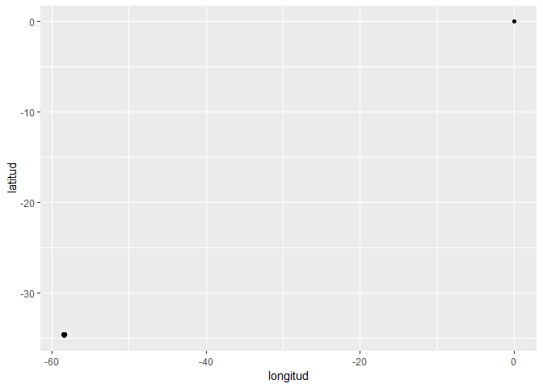

Ya vemos que hay algo raro... hay un puntito solitario en
`(lat=0, long=0)`. Podemos eliminarlo, entonces.

    delitos_limpios <- filter(delitos, latitud!=0 | longitud!=0)
    head(delitos_limpios)

    ##       id    comuna           barrio  latitud longitud      fecha     hora
    ## 1  68400  Comuna 3        BALVANERA -34.6141 -58.4117 2016-10-31 01:00:00
    ## 2  68401  Comuna 7           FLORES -34.6509 -58.4547 2016-10-31 02:30:00
    ## 3  68402  Comuna 4    NUEVA POMPEYA -34.6499 -58.4053 2016-10-31 04:00:00
    ## 4  68492 Comuna 13         BELGRANO -34.5615 -58.4557 2016-10-31 02:58:00
    ## 5 132437  Comuna 9          LINIERS -34.6524 -58.5193 2016-10-31 21:00:00
    ## 6 132469 Comuna 11 VILLA SANTA RITA -34.6218 -58.4833 2016-10-31 08:00:00
    ##          uso_arma uso_moto lugar origen_dato           tipo_delito
    ## 1 SIN USO DE ARMA SIN MOTO    NA          NA      Homicidio Doloso
    ## 2 SIN USO DE ARMA SIN MOTO    NA          NA      Homicidio Doloso
    ## 3 SIN USO DE ARMA SIN MOTO    NA          NA      Homicidio Doloso
    ## 4 SIN USO DE ARMA SIN MOTO    NA          NA    Homicidio Seg Vial
    ## 5 SIN USO DE ARMA SIN MOTO    NA          NA Hurto (Sin violencia)
    ## 6 SIN USO DE ARMA SIN MOTO    NA          NA Hurto (Sin violencia)
    ##   cantidad_vehiculos cantidad_victimas
    ## 1                  0                 0
    ## 2                  0                 0
    ## 3                  0                 0
    ## 4                  0                 1
    ## 5                  0                 0
    ## 6                  0                 0

Bien... ya hicimos una primera limpieza de los datos.

    ggplot(delitos_limpios) + 
            geom_point(aes(x=longitud, y=latitud))

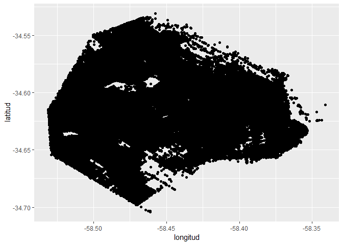

------------------------------------------------------------------------

#### ¿Qué pasó acá?

Acabamos de introducir una buena cantidad de código que conviene empezar
a revisar para ir fijando conceptos.

##### Gráficos

Acabamos de hacer una visualización bien rápida. Teníamos una varaiable
que medía la posición en el eje *X* (o sea la `longitud`) y otra que lo
hacía en el eje *Y* (`latutud`). Hicimos un scatterplot de eso, usando
la librería `ggplot2`. Hay dos pasos básicos para hacer un gráfico en
ggplot:

1.  `ggplot(delitos) +` =&gt; Creamos el objeto `ggplot` y lo "llenamos"
    con un dataset. En este caso, una `tibble`
2.  `geom_point(aes(x=longitud, y=latitud))` =&gt; agregamos una capa
    estética, en este caso de puntos.

Vamos a volver, pero en general, todos los gráficos de `ggplot2` se
construyen acumulando capas estéticas.

##### Filtros

Encontramos ¿una? inconsistencia en la base de datos. Básicamente, uno o
varios registros con coordenadas `latitud==0 & longitud==0`. Entonces,
usamos la instrucción `filter()` para filtrar los casos que cumplían con
esa condicion.

------------------------------------------------------------------------

PASO 3. Visualizando los datos
------------------------------

Ya vimos un scatterplot, muy útil para plotear la distribución conjunta
de dos variables cuantitativas. Sigamos con nuestro ejemplo y veamos
algunos parámetros para modificar la estética del plot (que vale para
cualquier `geom_XXX`).

### Tamaño, color y forma (y una proyección)

Pongamos un color más bonito que ese negro. Y aprovechemos para hacer
una aclaración. Estrictamente, estamos trabajando con variables de
coordenadas geográficas. No tenemos tiempo en el curso para trabajar en
detalle este tema pero digamos que son variables cuantitativas
"especiales". Cada mapa está dibujado según un sistema de coordenadas
que llevan la forma "geódica" de la tierra (básicamente, algo que está
en 3 dimensiones) a un plano (en 2 dimensiones).

Es decir que "deforman" la forma de la tierra para llevarla a la hoja de
papel (o a la pantalla, en este caso). Si se fijan, la CABA aparece
medio alargada en el mapa anterior. Esto es porque no le especificamos a
`ggplot`en qué sistema de coordenadas está.

Pasemos, entonces la capa `coord_map('mercator')`

------------------------------------------------------------------------

Para más detalles sobre sistemas de coordenadas y referencia pueden
consultar [Ciencia de Datos para Gente
Sociable](https://bitsandbricks.github.io/ciencia_de_datos_gente_sociable/)
de Antonio Vázquez Brust, material (y autor) que dieron una mano grande
a este curso -además de ser colega y amigo-.

------------------------------------------------------------------------

    ggplot(delitos_limpios) + 
            geom_point(aes(x=longitud, y=latitud), color='blue') +
            coord_map("mercator")

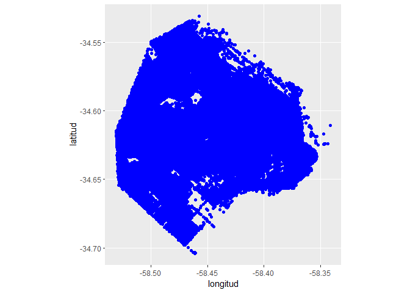

Ahora se parece más al Buenos Aires de Gardel...

Bien, cambiemos el tamaño de los puntitos. El parámetro `size` está en
pixels, por lo cual no es fácil estimarlo sin ver una versión previa del
plot, primero.

    ggplot(delitos_limpios) + 
            geom_point(aes(x=longitud, y=latitud), color='red', size=0.05) +
            coord_map("mercator")

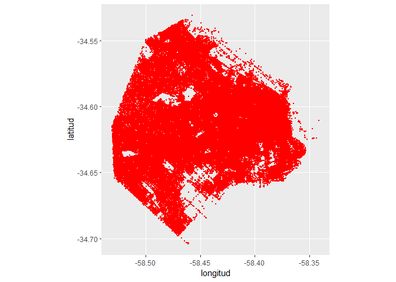

Y, por último, cambiemos la forma...

    ggplot(delitos_limpios) + 
            geom_point(aes(x=longitud, y=latitud), color='red', size=0.05, shape=3) +
            coord_map("mercator")

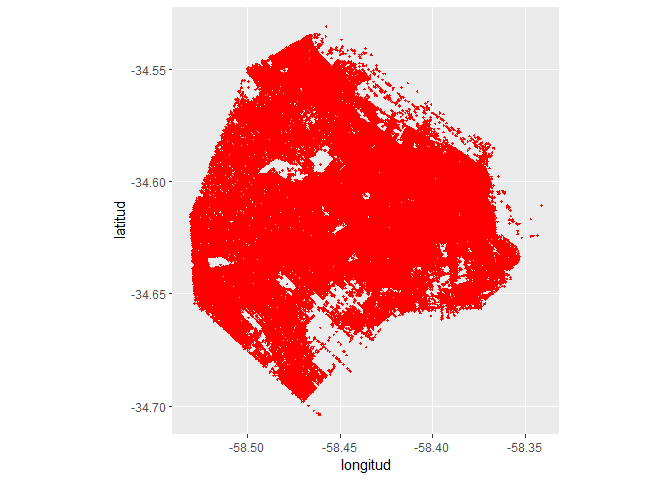

### Facetado

Ahora, si queremos agregar más dimensiones al plot... la cosa se hace un
poco más densa. Es por eso que podemos usar una nueva "capa" de
`ggplot`, llamada *facetado*. La idea es que podemos tener gráficos
continguos, condicioados a los valores de una variable (generalmente,
categórica). Veamos, entonces, un plot por cada uno de los tipos de
delitos...

    ggplot(delitos_limpios) + 
            geom_point(aes(x=longitud, y=latitud, color=tipo_delito), size=0.05, alpha=0.25) +
            facet_wrap(~tipo_delito) +
            coord_map("mercator")

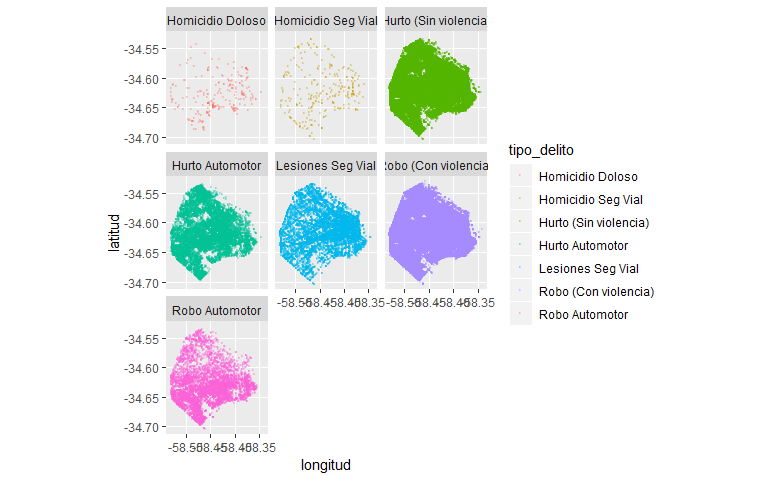

*¿Qué diferencias hay con los plots anteriores?*

------------------------------------------------------------------------

#### Consigna 1.

Generar los siguientes gráficos:

-   El gráfico anterior, variando la capa `facet_wrap` por `facet_grid`.
-   El gráfico anterior, sin facetado y con un color por cada tipo de
    delito.

------------------------------------------------------------------------

### Otros plots...

Veamos ahora cuáles son los tipos de delitos más comunes en la CABA.

    ggplot(delitos_limpios, aes(x=tipo_delito))+
            geom_bar(stat="count")

Se ve bastante bien... aunque tenemos acomodar un poco las etiquetas.
Una opción es pedirle a `ggplot` que las abrevie:

    ggplot(delitos_limpios, aes(x=tipo_delito))+
            geom_bar(stat="count") + 
            scale_x_discrete(labels = abbreviate)

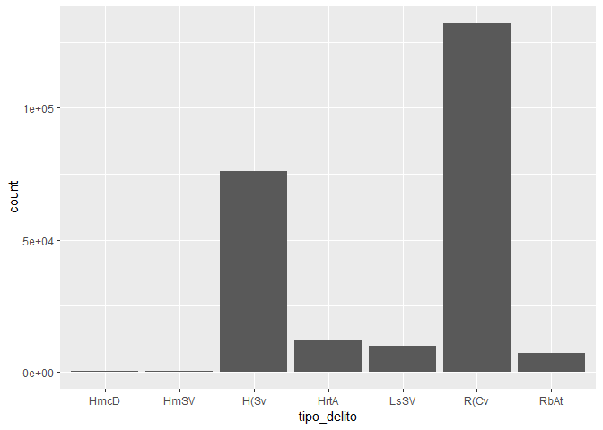

Otra es pasarle nosotros un vector de etiquetas:

    ggplot(delitos_limpios, aes(x=tipo_delito))+
            geom_bar(stat="count") + 
            scale_x_discrete(labels = c('H.doloso','H.seg.vial', 'Hurto(s/v)', 
                                        'Robo(c/v)', 'Robo auto', 'Hurto auto', 'Lesion.seg.vial'))

------------------------------------------------------------------------

#### Consigna 2.

Generar un gráfico de barras por comuna

------------------------------------------------------------------------

### Histogramas

Un histograma, como hemos visto, se usa para mostrar la distribución de
una variable continua. Por ejemplo, podríamos hacer un histograma de la
distribución de edades de la EPH o de los ingresos. No tenemos una
variable cuantitativa, vamos a inventarnos una. Pero previamente vamos a
tener que introducir algunas ideas de limpieza de datos...

PASO 4. Limpieza de datos
-------------------------

Recordemos:

-   cargamos librerías con `library()`
-   cargamos datos con `read_csv()`
-   filtramos datos con `filter()`
-   hicimos algunas visuzalizaciones básicas con `ggplot2`

Ahora la cosa se pone seria. Una de las primeras cosas que vamos a tener
que hacer es poder tener una visión más o menos general de la tabla con
la que estamos trabajando. Para eso, llamamos a la función `str()` que
puede usarse para cualquier clase de objeto en R.

    str(delitos_limpios)

    ## 'data.frame':    237445 obs. of  14 variables:
    ##  $ id                : int  68400 68401 68402 68492 132437 132469 132480 132566 132583 134576 ...
    ##  $ comuna            : Factor w/ 15 levels "Comuna 1","Comuna 10",..: 9 13 10 5 15 3 3 13 14 3 ...
    ##  $ barrio            : Factor w/ 48 levels "AGRONOMIA","ALMAGRO",..: 3 12 20 5 15 46 46 12 40 39 ...
    ##  $ latitud           : num  -34.6 -34.7 -34.6 -34.6 -34.7 ...
    ##  $ longitud          : num  -58.4 -58.5 -58.4 -58.5 -58.5 ...
    ##  $ fecha             : Factor w/ 731 levels "2016-01-01","2016-01-02",..: 305 305 305 305 305 305 305 305 305 305 ...
    ##  $ hora              : Factor w/ 1417 levels "00:00:00","00:01:00",..: 61 147 235 174 1238 458 1213 1088 1148 1358 ...
    ##  $ uso_arma          : Factor w/ 1 level "SIN USO DE ARMA": 1 1 1 1 1 1 1 1 1 1 ...
    ##  $ uso_moto          : Factor w/ 1 level "SIN MOTO": 1 1 1 1 1 1 1 1 1 1 ...
    ##  $ lugar             : logi  NA NA NA NA NA NA ...
    ##  $ origen_dato       : logi  NA NA NA NA NA NA ...
    ##  $ tipo_delito       : Factor w/ 7 levels "Homicidio Doloso",..: 1 1 1 2 3 3 6 3 6 3 ...
    ##  $ cantidad_vehiculos: int  0 0 0 0 0 0 0 0 0 0 ...
    ##  $ cantidad_victimas : int  0 0 0 1 0 0 0 0 0 0 ...

¿Qué se puede observar en esta salida?

-   Es un dataframe con 237.445 observaciones y 14 variables
-   Tenemos nombre, tipo y algunos valores de cada una de las variables
-   Hay varias columnas que son `factors`

Por defecto, R asume que toda columna de texto es un factor. Este último
punto puede llegar a traer problemas. Por eso suele ser buena idea
setear el argumento `stringsAsFactors=FALSE`:
`datos <- read.csv("/ruta/a/misdatos.csv", stringsAsFactors=FALSE)`.

Otro paso útil es llamar a la función `summary()`

    summary(delitos_limpios)

    ##        id               comuna               barrio          latitud      
    ##  Min.   :     1   Comuna 1 : 32898   PALERMO    : 19055   Min.   :-34.70  
    ##  1st Qu.: 59552   Comuna 3 : 19894   BALVANERA  : 15816   1st Qu.:-34.63  
    ##  Median :128908   Comuna 4 : 19475   FLORES     : 12939   Median :-34.61  
    ##  Mean   :125662   Comuna 14: 19056   SAN NICOLAS: 11586   Mean   :-34.61  
    ##  3rd Qu.:188423   Comuna 7 : 18034   CABALLITO  : 11573   3rd Qu.:-34.59  
    ##  Max.   :248024   Comuna 9 : 14886   RECOLETA   : 10974   Max.   :-34.53  
    ##                   (Other)  :113202   (Other)    :155502                   
    ##     longitud             fecha              hora       
    ##  Min.   :-58.53   2017-12-06:   495   00:00:00:  7953  
    ##  1st Qu.:-58.47   2017-12-11:   485   20:00:00:  7892  
    ##  Median :-58.43   2017-11-22:   479   21:00:00:  7512  
    ##  Mean   :-58.44   2017-04-03:   473   22:00:00:  7255  
    ##  3rd Qu.:-58.40   2017-03-20:   460   19:00:00:  6777  
    ##  Max.   :-58.34   2017-06-26:   456   18:00:00:  6338  
    ##                   (Other)   :234597   (Other) :193718  
    ##             uso_arma          uso_moto       lugar         origen_dato   
    ##  SIN USO DE ARMA:237445   SIN MOTO:237445   Mode:logical   Mode:logical  
    ##                                             NA's:237445    NA's:237445   
    ##                                                                          
    ##                                                                          
    ##                                                                          
    ##                                                                          
    ##                                                                          
    ##                 tipo_delito     cantidad_vehiculos cantidad_victimas 
    ##  Homicidio Doloso     :   272   Min.   :0          Min.   :0.000000  
    ##  Homicidio Seg Vial   :   264   1st Qu.:0          1st Qu.:0.000000  
    ##  Hurto (Sin violencia): 76002   Median :0          Median :0.000000  
    ##  Hurto Automotor      : 12075   Mean   :0          Mean   :0.001162  
    ##  Lesiones Seg Vial    :  9798   3rd Qu.:0          3rd Qu.:0.000000  
    ##  Robo (Con violencia) :132047   Max.   :0          Max.   :3.000000  
    ##  Robo Automotor       :  6987

Recordemos... las categorías de un factor en R se llamana "niveles"

-   ¿Cuáles de las variabes en este dataset son factors? Veamos los
    levels de una de ellas...

<!-- -->

    levels(delitos_limpios$barrio)

    ##  [1] "AGRONOMIA"         "ALMAGRO"           "BALVANERA"        
    ##  [4] "BARRACAS"          "BELGRANO"          "BOEDO"            
    ##  [7] "CABALLITO"         "CHACARITA"         "COGHLAND"         
    ## [10] "COLEGIALES"        "CONSTITUCION"      "FLORES"           
    ## [13] "FLORESTA"          "LA BOCA"           "LINIERS"          
    ## [16] "MATADEROS"         "MONTE CASTRO"      "MONTSERRAT"       
    ## [19] "NUÑEZ"            "NUEVA POMPEYA"     "PALERMO"          
    ## [22] "PARQUE AVELLANEDA" "PARQUE CHACABUCO"  "PARQUE CHAS"      
    ## [25] "PARQUE PATRICIOS"  "PATERNAL"          "PUERTO MADERO"    
    ## [28] "RECOLETA"          "RETIRO"            "SAAVEDRA"         
    ## [31] "SAN CRISTOBAL"     "SAN NICOLAS"       "SAN TELMO"        
    ## [34] "VELEZ SARSFIELD"   "VERSALLES"         "VILLA CRESPO"     
    ## [37] "VILLA DEL PARQUE"  "VILLA DEVOTO"      "VILLA GRAL MITRE" 
    ## [40] "VILLA LUGANO"      "VILLA LURO"        "VILLA ORTUZAR"    
    ## [43] "VILLA PUEYRREDON"  "VILLA REAL"        "VILLA RIACHUELO"  
    ## [46] "VILLA SANTA RITA"  "VILLA SOLDATI"     "VILLA URQUIZA"

En principio, esta variable parece estar bien. Sin embargo, existen al
menos otras dos variables que no parece tener demasiado sentido que
tengan formato de factor: fecha y hora. En efecto, existe un tipo de
dato especial en R para datos de tiempo, fecha, hora, etc. Vamos a hacer
uso del paquete `lubridate`:

    library(lubridate)

    delitos_limpios <- mutate(delitos_limpios, fecha=ymd(fecha), hora=hms(hora))

Aquí, usamos la instrucción `mutate()` para transformar las dos columnas
junto con las funciones `ymd()` por "year / month / day" y

Ahora estamos en condiciones de pensar nuestro histograma. Vamos a
contar cuántos hechos delictivos hubo por día y luego generaremos sobre
esta nueva tabla el histograma.

    p <- group_by(delitos_limpios, fecha) 
    periodo <- summarise(p, gran_total = n())

    head(periodo)

    ## # A tibble: 6 x 2
    ##   fecha      gran_total
    ##   <date>          <int>
    ## 1 2016-01-01        173
    ## 2 2016-01-02        217
    ## 3 2016-01-03        279
    ## 4 2016-01-04        320
    ## 5 2016-01-05        322
    ## 6 2016-01-06        341

Ahora, solamente, tenemos que crear a nuestro histograma:

------------------------------------------------------------------------

Hay unas cuántas instrucciones que no vimos y que retomaremos enseguida.
No obstante, el código es lo suficientemente expresivo como para poder
intuir qué pasó:

1.  tomamos el dataset original
2.  agrupamos por el campo "fecha" (es decir, por día)
3.  hicimos un conteo de cuántos registros había por cada día \*\*\*

<!-- -->

    ggplot(periodo) + 
            geom_histogram(aes(x = gran_total))

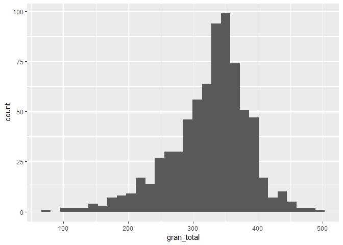

Podemos ver que hay un rango grande en la cantidad de delitos por día:

-   hubo días con menos de 100 delitos y días con 500
-   no obstante, la mayor parte de los días parecen conentrarse entre
    300 y 400 delitos

Podríamos también construir un histograma para cada tipo de delito...

    p <- group_by(delitos_limpios, fecha, tipo_delito)
    periodo <- summarise(p, gran_total=n())

    head(periodo)

    ## # A tibble: 6 x 3
    ## # Groups:   fecha [1]
    ##   fecha      tipo_delito           gran_total
    ##   <date>     <fct>                      <int>
    ## 1 2016-01-01 Homicidio Doloso               2
    ## 2 2016-01-01 Homicidio Seg Vial             1
    ## 3 2016-01-01 Hurto (Sin violencia)         48
    ## 4 2016-01-01 Hurto Automotor               10
    ## 5 2016-01-01 Robo (Con violencia)         108
    ## 6 2016-01-01 Robo Automotor                 4

Ahora, facetando...

    ggplot(periodo) + 
            geom_histogram(aes(x=gran_total)) + 
            facet_wrap(~tipo_delito)

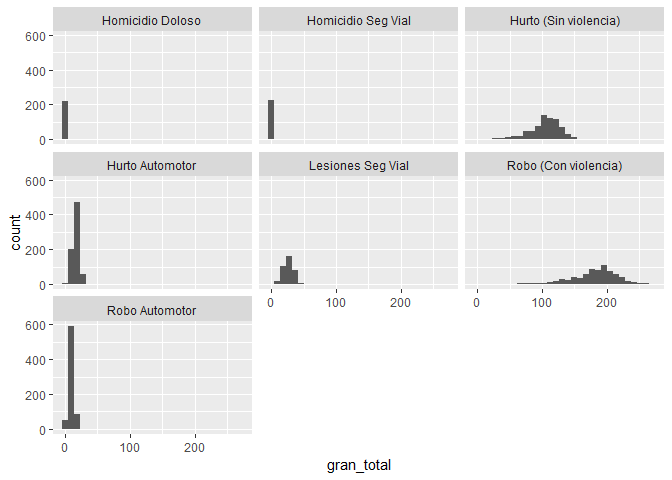

#### Integrando datos de diferentes fuentes

Ahora bien, en general al utilizar datos "en la vida real" no es
habitual tener una sola tabla. Es habitual tener que integrar datos de
varias fuentes. Ya trabajaremos con los datos de la [Encuesta Permanente
de Hogares del
INDEC](https://www.indec.gob.ar/bases-de-datos-eph-buc.asp) y veremos
que tenemos, al menos, dos tablas para trabajar: una correspondiente a
los datos de los individuos encuestados y otra correspondiente a los de
los hogares en que habitan esos individuos.

Ahora... supongamos que tenemos una nueva fuente de datos: los reclamos
del Sistema de Atención Ciudadana correspondientes a los años 2016 (uno
de los años que abarca el dataset de delitos):

    table(year(delitos_limpios$fecha))

    ## 
    ##   2016   2017 
    ## 117288 120157

    at_ciudadano <- read.csv("../data/sistema-unico-de-atencion-ciudadana-2016.csv", sep=";")
    head(at_ciudadano)

    ##   PERIODO
    ## 1  201601
    ## 2  201601
    ## 3  201601
    ## 4  201601
    ## 5  201601
    ## 6  201601
    ##                                                                                      CONCEPTO
    ## 1                                                       REPARACION DE BANCO EN PARQUE / PLAZA
    ## 2                                                SOLICITUD DE PAGO VOLUNTARIO DE INFRACCIONES
    ## 3                                                                            SEMAFORO APAGADO
    ## 4                                                          ESTACIONAMIENTO EN CORDON AMARILLO
    ## 5 ESTACIONAMIENTO OBSTRUYENDO RAMPA PARA PERSONAS CON DISCAPACIDAD U OTROS LUGARES PROHIBIDOS
    ## 6                                                SOLICITUD DE PAGO VOLUNTARIO DE INFRACCIONES
    ##                   RUBRO TIPO_PRESTACION FECHA_INGRESO  HORA_INGRESO
    ## 1                PLAZAS         RECLAMO    01/01/2016 12:00:45 A.M.
    ## 2 TRANSPORTE Y TRANSITO         TRAMITE    01/01/2016 02:09:24 A.M.
    ## 3 TRANSPORTE Y TRANSITO         RECLAMO    01/01/2016 03:12:22 A.M.
    ## 4   MAL ESTACIONAMIENTO        DENUNCIA    01/01/2016 03:35:15 A.M.
    ## 5   MAL ESTACIONAMIENTO        DENUNCIA    01/01/2016 03:44:43 A.M.
    ## 6 TRANSPORTE Y TRANSITO         TRAMITE    01/01/2016 03:44:54 A.M.
    ##   DOMICILIO_CGPC DOMICILIO_BARRIO                    DOMICILIO_CALLE
    ## 1       COMUNA 8    VILLA SOLDATI RABANAL, FRANCISCO, INTENDENTE AV.
    ## 2      COMUNA 10       VILLA REAL                            MOLIERE
    ## 3       COMUNA 8    VILLA SOLDATI RABANAL, FRANCISCO, INTENDENTE AV.
    ## 4      COMUNA 13         BELGRANO           QUINTEROS, LIDORO J. AV.
    ## 5      COMUNA 13         BELGRANO           QUINTEROS, LIDORO J. AV.
    ## 6       COMUNA 1    PUERTO MADERO                        PAINE, AIME
    ##   DOMICILIO_ALTURA DOMICILIO_ESQUINA_PROXIMA      LAT     LONG
    ## 1             3000                           -34,6645 -58,4365
    ## 2             2843                           -34,6161 -58,5268
    ## 3             2200                           -34,6596 -58,4273
    ## 4             1255                           -34,5508 -58,4506
    ## 5             1205                           -34,5505 -58,4505
    ## 6             1351                           -34,6128 -58,3615

Podríamos pensar que en aquellos barrios en los que mayor prevalencia de
delitos existe, debería verificarse una mayor cantidad de reclamos por
rubros asociados a estos delitos. Observemos previamente la estructura
de nuestro dataset e identifiquemos qué variable especifica el rubro de
reclamo y veamos los levels correspondientes...

    str(at_ciudadano)

    ## 'data.frame':    965951 obs. of  13 variables:
    ##  $ PERIODO                  : int  201601 201601 201601 201601 201601 201601 201601 201601 201601 201601 ...
    ##  $ CONCEPTO                 : Factor w/ 373 levels "ABONOS DE DESCUENTO POR VOLUMEN - SUBTE",..: 259 332 320 72 77 332 77 332 77 332 ...
    ##  $ RUBRO                    : Factor w/ 49 levels "","ACTOS DE CORRUPCION",..: 28 45 45 23 23 45 23 45 23 45 ...
    ##  $ TIPO_PRESTACION          : Factor w/ 5 levels "DENUNCIA","QUEJA",..: 3 5 3 1 1 5 1 5 1 5 ...
    ##  $ FECHA_INGRESO            : Factor w/ 363 levels "","01/01/2016",..: 2 2 2 2 2 2 2 2 2 2 ...
    ##  $ HORA_INGRESO             : Factor w/ 72730 levels "","01:00:00 A.M.",..: 65810 7210 12662 14455 15170 15189 15586 15594 16049 16615 ...
    ##  $ DOMICILIO_CGPC           : Factor w/ 16 levels "COMUNA 1","COMUNA 10",..: 14 2 14 5 5 1 5 1 5 1 ...
    ##  $ DOMICILIO_BARRIO         : Factor w/ 49 levels "","AGRONOMIA",..: 48 45 48 6 6 28 6 28 6 28 ...
    ##  $ DOMICILIO_CALLE          : Factor w/ 2190 levels "","11 DE SEPTIEMBRE DE 1888",..: 1702 1388 1702 1695 1695 1538 1695 1538 1695 1538 ...
    ##  $ DOMICILIO_ALTURA         : Factor w/ 8788 levels "","$ 4.216,00",..: 2719 2543 1830 633 560 794 560 794 627 794 ...
    ##  $ DOMICILIO_ESQUINA_PROXIMA: Factor w/ 1756 levels "","11 DE SEPTIEMBRE DE 1888",..: 1 1 1 1 1 1 1 1 1 1 ...
    ##  $ LAT                      : Factor w/ 37042 levels "","-103,611",..: 32721 20698 31819 3886 3824 19813 3824 19813 3886 19813 ...
    ##  $ LONG                     : Factor w/ 44969 levels "","-116,7084",..: 21533 44386 19149 25205 25179 4210 25179 4210 25152 4210 ...

Haciendo una inspección rápida, puede verse que

-   DENUNCIAS SOBRE INCONDUCTAS REFERIDAS A LA ACTUACION POLICIAL
-   EMERGENCIAS
-   SEGURIDAD
-   SEGURIDAD E HIGIENE

son las categorías que podrían estar asociadas a reclamos por
inseguridad y hechos delictivos.

#### Transformando y vinculando datos: los 5 verbos del `tidyverse`

Ahora bien... ¿cómo vinculamos ambas tablas? El problema es que en ambos
casos tenemos registros individuales (delitos en una caso, reclamos en
otro). Tenemos, entonces, que agregarlos de alguna forma a una unidad
común. En pricipio, hay una columna "BARRIO" en ambas. Eso es una
primera posibildiad. Contemos, entonces, la cantidad de delitos (total)
por barrio y la cantidad de reclamosen las cuatro categorías anteriores
y peguemos ambas tablas juntas. Esto nos va a permitir introducir varias
funciones, operadores y comandos sumamente útiles.

Para hacer todo esto, y mucho más, vamos a aprender funciones que
representan cinco verbos básicos para la transformación de datos:

-   `select()`: seleccionar -elegir- columnas por su nombre
-   `filter()`: filtrar, es decir quedarse sólo con las filas que
    cumplan cierta condición
-   `arrange()`: ordenar las filas de acuerdo a su contenido o algún
    otro índice
-   `mutate()`: mutar -cambiar- un dataframe, modificando el contenido
    de sus columnas o creando columnas (es decir, variables) nuevas
-   `summarise()`: producir sumarios -un valor extraído de muchos, por
    ejemplo el promedio- con el contenido de las columnas

Estas funciones tienen una sintaxis, una forma de escribirse, uniforme.
El primer argumento que toman siempre es un dataframe; los siguientes
indican qué hacer con los datos. El resultado siempre es un nuevo
dataframe.

Las funciones son parte de `dplyr`, uno de los componentes de la familia
de paquetes Tidyverse. Ya tenemos disponible todo lo necesario, activado
cuando invocamos `library(tidiverse)` al comienzo.

Empecemos por el dataset `at_ciudadano`.

1.  Lo primero que tenemos que hacer es seleccionar las columnas con las
    que vamos a trabajar. Para ello, vamos a introducir la función
    `select()`

<!-- -->

    at_barrio <- select(at_ciudadano, DOMICILIO_BARRIO, RUBRO)
    head(at_barrio)

    ##   DOMICILIO_BARRIO                 RUBRO
    ## 1    VILLA SOLDATI                PLAZAS
    ## 2       VILLA REAL TRANSPORTE Y TRANSITO
    ## 3    VILLA SOLDATI TRANSPORTE Y TRANSITO
    ## 4         BELGRANO   MAL ESTACIONAMIENTO
    ## 5         BELGRANO   MAL ESTACIONAMIENTO
    ## 6    PUERTO MADERO TRANSPORTE Y TRANSITO

1.  Luego, vamos a filtrar -`filter()`- las categorías que no nos
    interesan:

<!-- -->

    at_barrio <- filter(at_barrio, RUBRO == 'DENUNCIAS SOBRE INCONDUCTAS REFERIDAS A LA ACTUACION POLICIAL' | RUBRO == 'EMERGENCIAS' |  RUBRO == 'SEGURIDAD' | RUBRO == 'SEGURIDAD E HIGIENE' | RUBRO == 'VEHICULOS DE FANTASIA')

1.  Ahora, deberíamos sumar la cantidad de reclamos por barrio
    -`group_by() + summarise()`:

<!-- -->

    at_barrio_agg <- group_by(at_barrio, DOMICILIO_BARRIO)
    at_barrio_agg <- summarize(at_barrio_agg, total=n())

1.  Por último, y como para ser gente prolija, ordenemos en forma
    descendente los barrios:

<!-- -->

    at_barrio_agg <- arrange(at_barrio_agg, desc(total))
    head(at_barrio_agg)

    ## # A tibble: 6 x 2
    ##   DOMICILIO_BARRIO total
    ##   <fct>            <int>
    ## 1 BALVANERA          108
    ## 2 SAN NICOLAS        108
    ## 3 FLORES              92
    ## 4 CONSTITUCION        65
    ## 5 MONSERRAT           63
    ## 6 PALERMO             60

Entonces, hasta acá vimos tres de los cinco verbos... Nos falta analizar
`mutate()`. Sobre eso volveremos enseguida.

### Operador pipe `%>%`

Antes de terminar, vamos a presentar una herramienta más: el operador
pipe (pronúnciese “paip”, es el término en inglés que significa “tubo”).

El pipe es un operador: un símbolo que relaciona dos entidades. Dicho en
forma más simple, el pipe de R, cuyo símbolo es %&gt;% está en familia
con otros operadores más convencionales, como +, - o /. Y al igual que
los otros operadores, entrega un resultado en base a los operandos que
recibe. Ahora bien… ¿Para qué sirve? En resumidas cuentas, hace que el
código necesario para realizar una serie de operaciones de
transformación de datos sea mucho más simple de escribir y de
interpretar.

Repasemos la secuencia anterior...

1.  Seleccionamos las columnas a usar
2.  Filtramos registros
3.  Generamos un resumen
4.  Ordenamos en forma descendente

Pegando todo el código junto...

    at_barrio <- select(at_ciudadano, DOMICILIO_BARRIO, RUBRO)

    at_barrio <- filter(at_barrio, RUBRO == 'DENUNCIAS SOBRE INCONDUCTAS REFERIDAS A LA ACTUACION POLICIAL' | RUBRO == 'EMERGENCIAS' |  RUBRO == 'SEGURIDAD' | RUBRO == 'SEGURIDAD E HIGIENE' | RUBRO == 'VEHICULOS DE FANTASIA')

    at_barrio_agg <- group_by(at_barrio, DOMICILIO_BARRIO)

    at_barrio_agg <- summarize(at_barrio_agg, total=n())

    arrange(at_barrio_agg, desc(total))

    ## # A tibble: 44 x 2
    ##    DOMICILIO_BARRIO total
    ##    <fct>            <int>
    ##  1 BALVANERA          108
    ##  2 SAN NICOLAS        108
    ##  3 FLORES              92
    ##  4 CONSTITUCION        65
    ##  5 MONSERRAT           63
    ##  6 PALERMO             60
    ##  7 RECOLETA            48
    ##  8 CABALLITO           46
    ##  9 BELGRANO            40
    ## 10 VILLA URQUIZA       35
    ## # ... with 34 more rows

Todo bien, pero el problema es que hemos generado unas cuantas variables
(“at\_barrio”, “at\_barrio\_agg”) que no volveremos a usar. Además de
ser inútiles una vez obtenido el resultado buscado, estas variables
intermedias requieren que las nombremos. Decidir el nombre de estas
variables que no nos importan toma tiempo (sobre todo cuando producimos
muchas), y nos distrae de lo importante, que es el análisis.

El pipe, %&gt;%, permite encadenar operaciones, conectando el resultado
de una como el dato de entrada de la siguiente. La misma secuencia que
realizamos antes puede resolverse con pipes, quedando así:

    at_barrio <- select(at_ciudadano, DOMICILIO_BARRIO, RUBRO) %>%
            filter(RUBRO == 'DENUNCIAS SOBRE INCONDUCTAS REFERIDAS A LA ACTUACION POLICIAL' | 
                           RUBRO == 'EMERGENCIAS' |  RUBRO == 'SEGURIDAD' | 
                           RUBRO == 'SEGURIDAD E HIGIENE' | RUBRO == 'VEHICULOS DE FANTASIA') %>%
            group_by(DOMICILIO_BARRIO) %>% 
            summarize(total=n()) %>% 
            arrange(desc(total))

    head(at_barrio)

    ## # A tibble: 6 x 2
    ##   DOMICILIO_BARRIO total
    ##   <fct>            <int>
    ## 1 BALVANERA          108
    ## 2 SAN NICOLAS        108
    ## 3 FLORES              92
    ## 4 CONSTITUCION        65
    ## 5 MONSERRAT           63
    ## 6 PALERMO             60

------------------------------------------------------------------------

#### ¿Qué pasó acá?

-   Verbos en `tidyverse`...
-   Operador `%>%` en `magritt`

------------------------------------------------------------------------

------------------------------------------------------------------------

#### Consigna 3.

Repetir el proceso para generar una tabla de cantidad de delitos por
barrio usando el operador pipe...

------------------------------------------------------------------------

    delitos_barrio <- select(delitos_limpios, barrio, tipo_delito) %>%
            group_by(barrio) %>% 
            summarize(total=n()) %>% 
            arrange(desc(total))

    head(delitos_barrio)

    ## # A tibble: 6 x 2
    ##   barrio      total
    ##   <fct>       <int>
    ## 1 PALERMO     19055
    ## 2 BALVANERA   15816
    ## 3 FLORES      12939
    ## 4 SAN NICOLAS 11586
    ## 5 CABALLITO   11573
    ## 6 RECOLETA    10974

El último paso es "unir" las dos tablas. Para eso vamos a usar el
operador `left_join`.

    barrios <- left_join(delitos_barrio, at_barrio)
    barrios

    ## # A tibble: 48 x 3
    ##    barrio       total DOMICILIO_BARRIO
    ##    <fct>        <int> <fct>           
    ##  1 PALERMO      19055 <NA>            
    ##  2 BALVANERA    15816 <NA>            
    ##  3 FLORES       12939 <NA>            
    ##  4 SAN NICOLAS  11586 <NA>            
    ##  5 CABALLITO    11573 <NA>            
    ##  6 RECOLETA     10974 <NA>            
    ##  7 ALMAGRO       9539 <NA>            
    ##  8 BELGRANO      7814 <NA>            
    ##  9 VILLA LUGANO  7674 <NA>            
    ## 10 BARRACAS      6919 <NA>            
    ## # ... with 38 more rows

`left_join` usa como clave las columnas que en las dos tablas tengan el
mismo nombre. Parece que tenemos un problema: las tablas tienen una sola
columna con un nombre en común ("total") y justamente, no es esa la que
queremos para joinear ambas variables. La que queremos es la que
contiene el barrio, el problema es que se llaman distinto. Solucionemos
este problema:

    at_barrio <- at_barrio %>%
                    rename(barrio=DOMICILIO_BARRIO)

    barrios <- left_join(delitos_barrio, at_barrio, by='barrio')

    ## Warning: Column `barrio` joining factors with different levels, coercing to
    ## character vector

Funciona mejor, pero vemos todavía que queda unos cuántos barrios que no
se han joineado.

    filter(barrios, is.na(total.y))

    ## # A tibble: 7 x 3
    ##   barrio           total.x total.y
    ##   <chr>              <int>   <int>
    ## 1 MONTSERRAT          5681      NA
    ## 2 LA BOCA             3327      NA
    ## 3 VILLA GRAL MITRE    2640      NA
    ## 4 MONTE CASTRO        2099      NA
    ## 5 VERSALLES           1118      NA
    ## 6 VILLA REAL          1082      NA
    ## 7 COGHLAND             961      NA

Seguramente, se deba a que se encuentran escritas de forma diferente en
ambas tablas. Así que vamos a unificar su escritura... Solo por esta
vez, hagámoslo usando solamente el R-base y no el tidyverse...

    at_barrio$barrio <- as.character(at_barrio$barrio)
    at_barrio$barrio[at_barrio$barrio=='MONSERRAT'] <- 'MONTSERRAT'
    at_barrio$barrio[at_barrio$barrio=='BOCA'] <- 'LA BOCA'
    at_barrio$barrio[at_barrio$barrio=='VILLA GRAL. MITRE'] <- 'VILLA GRAL MITRE'
    at_barrio$barrio[at_barrio$barrio=='COGHLAN'] <- 'COGHLAND'
    at_barrio$barrio <- as.factor(at_barrio$barrio)

Hacemos el `left_join()`. Aprovechamos para darles un nombre coherente a
las variables. Y vemos que quedan aún algunos datos con NA: se trata de
barrios que no tienen datos en la tabla de at\_barrio.

    barrios <- left_join(delitos_barrio, at_barrio, by='barrio') %>%
                            rename(n_delitos = total.x, n_reclamos=total.y)

    ## Warning: Column `barrio` joining factors with different levels, coercing to
    ## character vector

Podríamos filtrarlos fácilmente:

    barrios %>%
            filter(!is.na(n_reclamos))

    ## # A tibble: 44 x 3
    ##    barrio       n_delitos n_reclamos
    ##    <chr>            <int>      <int>
    ##  1 PALERMO          19055         60
    ##  2 BALVANERA        15816        108
    ##  3 FLORES           12939         92
    ##  4 SAN NICOLAS      11586        108
    ##  5 CABALLITO        11573         46
    ##  6 RECOLETA         10974         48
    ##  7 ALMAGRO           9539         19
    ##  8 BELGRANO          7814         40
    ##  9 VILLA LUGANO      7674          3
    ## 10 BARRACAS          6919         12
    ## # ... with 34 more rows

Pero mejor vamos a asigarnles un valor de igual a 0:

    barrios <- barrios %>% 
            mutate(n_reclamos=replace_na(n_reclamos, 0))

------------------------------------------------------------------------

#### Consigna 4.

1.  Realizar un scatterplot de la cantidad de delitos contra la cantidad
    de reclamos por seguridad.

------------------------------------------------------------------------

     ggplot(barrios, aes(x=n_delitos, y=n_reclamos), color='red') + 
            geom_point() + 
            geom_smooth(method = 'lm') +
             labs(title = "Delitos registrados según contactos al SIUAC vinculados a seguridad",
             subtitle = "Barrios de la CABA, 2016 - 2017",
             caption = "Fuente: portal de datos abiertos de la Ciudad - http://data.buenosaires.gob.ar",
             x = "Cantidad de delitos",
             y = "Cantidad de contactos")

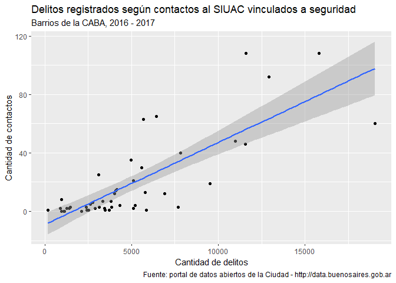

Vamos a ver dos últimas cuestiones vinculadas a la construcción de
gráficos en `ggplot2`.

*Generación de títulos en el gráfico:* siempre es importate poder
transmitir de forma clara qué información se encuentra en el mismo. En
general, hay varias reglas y formas de hacerlo pero al menos cuatro
elemenos tienen que existir:

-   Título en el que deben estar expresadas de forma clara las variables
    que se grafican, el período temporal y el área o región al que
    corresponde el gráfico.
-   Etiquetas en los ejes
-   Leyendas
-   Fuente de los datos

Todo puede ser manjeando con la capa `labs`

*Curva de ajuste:* podemos agregar una a los datos del scatter mediante
`geom_smooth`. Aquí hay varios parámetros. Veremos dos que son los más
importantes.

-   `method`: puede asumir varios valores, correspondientes a diferentes
    métodos para generar la recta de ajuste. El que usamos previamente
    es `method='lm'` que ajusta una recta mediante un modelo lineal.
    Existen otros, como `method=loess`.
-   En el caso de métodos como loess o lowess que usan una ventansd`sd`a
    de valores locales, el parámetro `span` controla el "ancho" de la
    ventana
-   `se`: `TRUE`, calcula y despliega el error estándar para cada punto
    de la curva ajustada.

<!-- -->

     ggplot(barrios, aes(x=n_delitos, y=n_reclamos), color='red') + 
            geom_point() + 
            geom_smooth(method = 'loess', span=0.8, se=FALSE) +
             labs(title = "Delitos registrados según contactos al SIUAC vinculados a seguridad",
             subtitle = "Barrios de la CABA, 2016 - 2017",
             caption = "Fuente: portal de datos abiertos de la Ciudad - http://data.buenosaires.gob.ar",
             x = "Cantidad de delitos",
             y = "Cantidad de contactos")

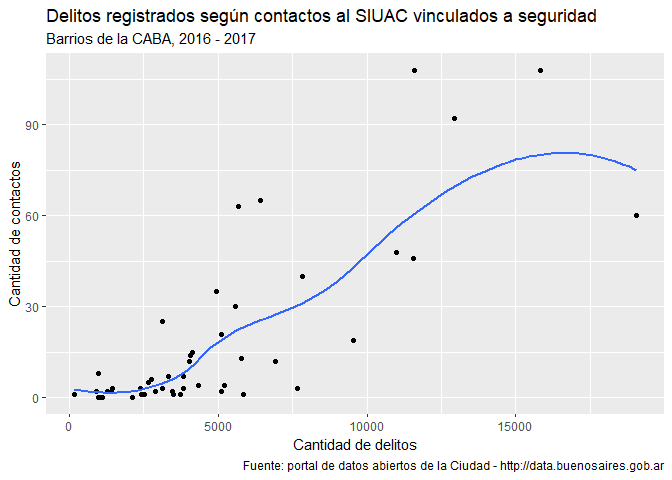

     ggplot(barrios, aes(x=n_delitos, y=n_reclamos), color='red') + 
            geom_point() + 
            geom_smooth(method = 'loess', span=0.3) +
             labs(title = "Delitos registrados según contactos al SIUAC vinculados a seguridad",
             subtitle = "Barrios de la CABA, 2016 - 2017",
             caption = "Fuente: portal de datos abiertos de la Ciudad - http://data.buenosaires.gob.ar",
             x = "Cantidad de delitos",
             y = "Cantidad de contactos")

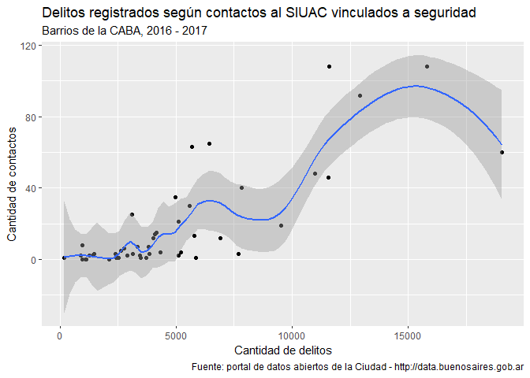
